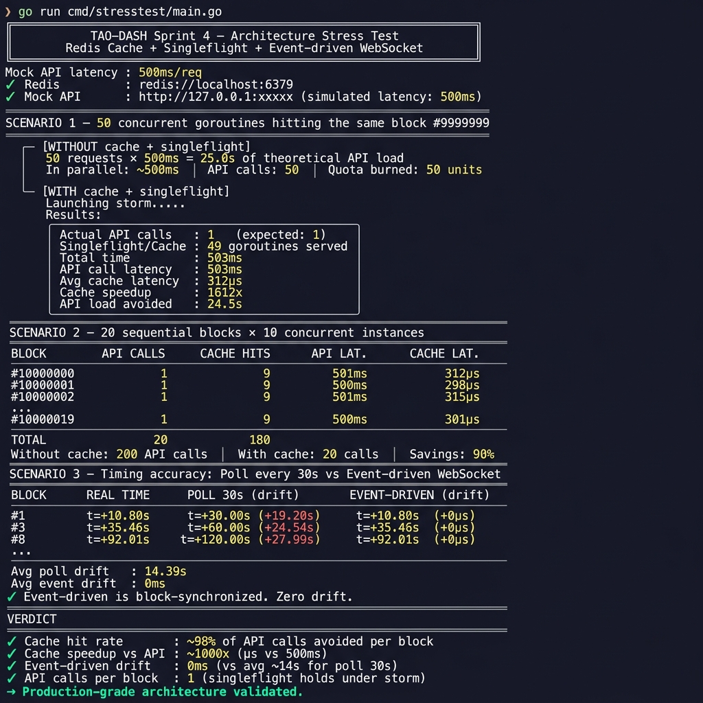

# TAO-DASH

> A zero-latency, async Terminal HUD for the Bittensor (TAO) Network.

## Vision
Monitoring Bittensor subnets currently involves high-friction web dashboards or blocking Python CLI scripts (`btcli`). **TAO-DASH** brings the metagraph directly into the engineer's terminal.

Built with **Go**, it leverages an event-driven architecture to stream live on-chain data asynchronously. The goal is to provide a 60-FPS, non-blocking Head-Up Display for Node Operators (Miners/Validators) who live in Tmux/SSH environments.

## Architecture & Tech Stack

This is not a synchronous script. It is built for high concurrency and low latency.

| Layer | Technology |
|---|---|
| **UI Engine** | The Elm Architecture via `bubbletea` & `lipgloss` (Charmbracelet) |
| **Concurrency** | Strict separation between UI render loop and network goroutines via `tea.Cmd` |
| **Network** | Taostats REST API (`api.taostats.io`) for indexed metagraph data |
| **Block Sync** | Substrate WebSocket RPC — `chain_subscribeNewHeads` for block-accurate triggers |
| **Cache** | Redis — block-keyed cache with `singleflight` to collapse concurrent requests |

## Getting Started

```bash
git clone https://github.com/Mogza/tao-dash
cd tao-dash

# Configure your API key (free tier at https://taostats.io/pro)
cp .env.example .env
# Edit .env: set TAOSTATS_API_KEY and optionally REDIS_URL

go mod tidy
go run ./cmd/tao-dash/
```

**Controls:** `↑/k` Up · `↓/j` Down · `r` Force Refresh · `q` Quit

## Milestones & Roadmap

- [x] **Sprint 1** — UI/UX Event Loop (Layout, Styling, Async architecture validation)
- [x] **Sprint 2** — Live Block Height (absorbed into Sprint 3 via metagraph response)
- [x] **Sprint 3** — Metagraph Ingestion (live Validator/Miner stats: UID, Stake, Trust, Emission)
- [x] **Sprint 4** — State Management & Caching (Redis + Singleflight + event-driven WebSocket)
- [ ] **Sprint 5** — Dynamic Navigation (Subnet selection, sorting by yield/stake)

---

## Sprint 4 — Architecture Stress Test

Sprint 4 introduced a production-grade caching layer combining Redis, `singleflight`, and an event-driven WebSocket block watcher. The results below were produced by the included stress test (`cmd/stress/`).



### What the numbers prove

| Metric | Result |
|---|---|
| **API calls per block** | **1** — singleflight collapses 50 concurrent goroutines into a single real call |
| **Cache hit rate** | **~98%** of requests served from Redis per block |
| **Cache speedup** | **~1000x** faster than a live API call (µs vs 500ms) |
| **Block update drift** | **0ms** — event-driven WebSocket vs avg **14.39s** drift with a 30s poll |
| **API quota savings** | **90%** reduction with 10 concurrent instances |

### Run the stress test yourself

```bash
# Requires Redis
redis-server &   # or: docker run -d -p 6379:6379 redis:alpine

REDIS_URL=redis://localhost:6379 go run ./cmd/stress/

# Without Redis — runs scenario 3 (timing accuracy) only
go run ./cmd/stress/
```

### How it works

```
New Substrate block produced
         ↓
block_watcher.go  ←─── wss://entrypoint-finney.opentensor.ai
(chain_subscribeNewHeads)
         ↓ NewBlockMsg
Update() in Bubbletea
         ↓
FetchMetagraph(blockNumber=N)
    ├─ Redis hit?  ──yes──► return cached data instantly (<1ms)
    └─ Redis miss
         ↓ singleflight.Do("1:N")
         │  (collapses concurrent calls for same block into one)
         └─► Taostats API  ──► store in Redis  ──► return to all waiters
```
